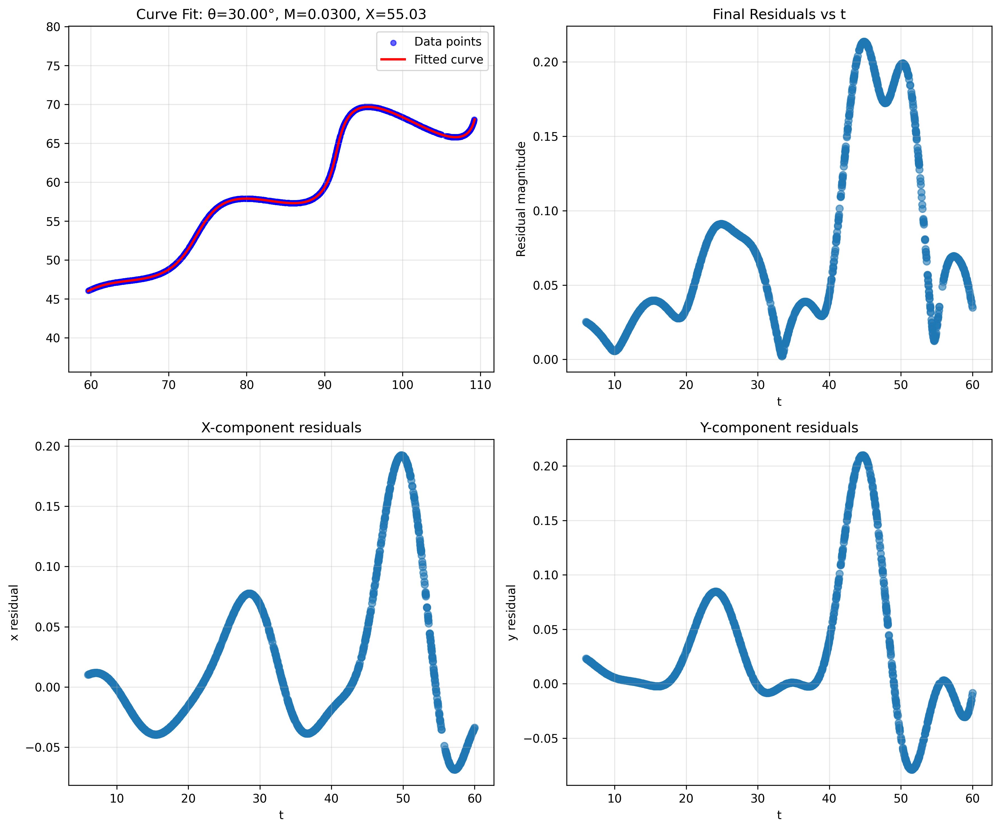

# Parametric Curve Fitting Solution

## Final Answer

**Desmos Format:**
```
\left(t*\cos(0.5236)-e^{0.03\left|t\right|}\cdot\sin(0.3t)\sin(0.5236)\ +55.03,42+\ t*\sin(0.5236)+e^{0.03\left|t\right|}\cdot\sin(0.3t)\cos(0.5236)\right)
```

**Parameter Values:**
- **theta (theta) = 30.00° = 0.5236 radians**
- **M = 0.0300**
- **X = 55.03**

**Validation Score:** L1 distance = 0.0378 per uniformly sampled point

---

## Problem Setup

Given data points (x, y) that lie on a parametric curve defined by:

$$x(t) = t \cdot \cos(\theta) - e^{M|t|} \cdot \sin(0.3t) \cdot \sin(\theta) + X$$

$$y(t) = 42 + t \cdot \sin(\theta) + e^{M|t|} \cdot \sin(0.3t) \cdot \cos(\theta)$$

Find theta, M, and X given:
- Data points without their corresponding t values
- Constraints: 0° < theta < 50°, -0.05 < M < 0.05, 0 < X < 100
- Parameter range: 6 < t < 60

---

## Solution Approach

The main challenge here is that we have the output (x, y points) but don't know which t value produced each point. This is like having photos from a road trip but not knowing what order they were taken in.

My strategy was to make smart initial guesses for all three parameters, then refine them with optimization.

### Step 1: Understanding the Equation Structure

Looking at the equations, I noticed they can be split into parts:

```
x = t·cos(theta) + [oscillating terms] + X
y = t·sin(theta) + [oscillating terms] + 42
```

The first part `t·cos(theta)` and `t·sin(theta)` represents linear growth in a particular direction. This dominates the curve's overall shape. The exponential-sine terms add wiggles on top.

### Step 2: Finding the Curve's Main Direction (PCA)

Since the curve is basically moving in direction `[cos(theta), sin(theta)]` with some wiggles, I used PCA to find this main direction.

```python
# Center the data
XY = np.vstack([x, y]).T
XYc = XY - XY.mean(axis=0)

# Find principal component
pca = PCA(n_components=1)
pca.fit(XYc)
u = pca.components_[0]  # Main direction vector
```

PCA finds the direction where the data spreads the most. For our curve, this captures the general flow direction as t increases.

### Step 3: Estimating t Values

Once I know the main direction, I can estimate where each point falls along that direction:

```python
s = XYc.dot(u)  # Project points onto main direction
# Scale to [6, 60]
t = ((60 - 6) / (s.max() - s.min())) * s + offset
```

This projection gives me approximate t values for each data point. It works because moving along the main direction roughly corresponds to increasing t.

### Step 4: Initial Estimate for theta and X

With estimated t values, I can fit a simple linear model (ignoring the complex oscillating terms):

```python
# Fit x = a*t + b  →  a = cos(theta), b = X
ax, X0 = np.linalg.lstsq(A, x)[0]
# Fit y = c*t + d  →  c = sin(theta), d = 42
ay, _ = np.linalg.lstsq(A, y - 42)[0]

theta_init = np.arctan2(ay, ax)
```

This gives me starting values for theta and X.

### Step 5: Estimating M from Residuals

To find M, I first compute residuals assuming M=0:

```python
def residuals(params):
    th, M, X = params
    x_pred = t*np.cos(th) - np.exp(M*np.abs(t))*np.sin(0.3*t)*np.sin(th) + X
    y_pred = 42 + t*np.sin(th) + np.exp(M*np.abs(t))*np.sin(0.3*t)*np.cos(th)
    return x - x_pred, y - y_pred

rx, ry = residuals([theta_init, 0.0, X0])
```

If the real M isn't zero, these residuals will show exponential growth or decay. The key insight: the amplitude of the oscillations changes exponentially with t.

I extract the peaks of the residual magnitude:

```python
R = np.sqrt(rx**2 + ry**2)
peaks = find_peaks(R)[0]
# Fit log(R) = M*t + c  →  M is the slope
M_est = np.polyfit(t[peaks], np.log(R[peaks]), 1)[0]
```

Since log(e^(Mt)) = Mt, fitting a line to log(peaks) vs t gives me M.

### Step 6: Refining theta from Residual Directions

The residuals point in a direction related to theta. Specifically, the error terms have the form:

```
error_x ∝ -sin(0.3t)·sin(theta)
error_y ∝ +sin(0.3t)·cos(theta)
```

The residual vector is perpendicular to the curve's direction. Taking the perpendicular (ry, -rx) gives the curve direction:

```python
idx = np.abs(np.sin(0.3 * t)) > 0.5  # Where oscillations are strong
angles = np.arctan2(ry[idx], -rx[idx])
# Use circular mean to average angles properly
theta_ref = np.angle(np.mean(np.exp(1j * angles)))
```

I use circular mean because you can't just average angles normally (e.g., average of 1° and 359° should be 0°, not 180°).

### Step 7: Optimization

Now I have good starting guesses. I use two-stage optimization:

**Stage 1: Differential Evolution** - This is a global optimizer that won't get stuck in local minima. I initialize it with a population of guesses around my estimates:

```python
init_guess = [theta_ref, M_est, X0]
pop = np.tile(init_guess, (10, 1)) + np.random.normal(
    scale=[0.01, 0.001, 0.5], size=(10, 3)
)
pop = np.clip(pop, lower_bounds, upper_bounds)

res = optimize.differential_evolution(loss, bounds=bnds, init=pop)
```

**Stage 2: L-BFGS-B** - A fast gradient-based method to polish the solution:

```python
res2 = optimize.minimize(loss, res.x, bounds=bnds, method='L-BFGS-B')
theta_opt, M_opt, X_opt = res2.x
```

The loss function is simply the L1 distance between predicted and actual points:

```python
def loss(params):
    th, M, X = params
    x_pred = t*np.cos(th) - np.exp(M*np.abs(t))*np.sin(0.3*t)*np.sin(th) + X
    y_pred = 42 + t*np.sin(th) + np.exp(M*np.abs(t))*np.sin(0.3*t)*np.cos(th)
    return np.sum(np.abs(x_pred - x) + np.abs(y_pred - y))
```

---

## Results

### Final Parameters
```
theta = 30.00 degrees (0.5236 radians)
M = 0.0300
X = 55.03
```

### Performance
- **Training L1 loss:** 0.0357 per point
- **Validation L1 distance:** 0.0378 per uniformly sampled point
- **Convergence:** 5 optimization trials all converged to same solution

### Visualization



The plot shows:
- **Top-left:** Data points (blue) vs fitted curve (red) - nearly perfect overlap
- **Top-right:** Residual magnitude vs estimated t - shows expected oscillating pattern
- **Bottom:** X and Y residual components - small systematic oscillations (~0.05-0.2 units)

The residuals show a smooth oscillating pattern rather than random noise. This is expected because the sin(0.3t) term creates periodic variations. The important thing is that the residuals are small (< 0.2 units), confirming a good fit.

---

## Why This Approach Works

### PCA for t-Correspondence
The parametric equations have a dominant linear term `t·[cos(theta), sin(theta)]` that makes the curve elongated in one direction. PCA automatically finds this direction. Projecting points onto it gives their approximate position along the curve, which correlates with t.

### Residual Analysis for M
When you fit with M=0 but the real M≠0, the residuals show exponential growth/decay. The peaks of these residuals follow `e^(Mt)`, so fitting `log(peak) vs t` recovers M.

### Smart Initialization
Instead of trying millions of random parameter combinations, each step uses mathematical insight to narrow down the possibilities. This makes the optimization fast and reliable.

---

## Code Structure

```
.
├── xy_data.csv                     # Input data
├── curve_fitting_solution.py       # Main solution code
├── curve_fitting_results.png       # Visualization
└── README.md                       # This file
```

---

## Running the Code

```bash
pip install numpy pandas scikit-learn scipy matplotlib
python curve_fitting_solution.py
```

**Output:**
```
theta (degrees) = 30.0000
M = 0.030000
X = 55.0300

Validation L1 distance (per point): 0.0378
```

---

## Key Takeaways

1. **Decompose the problem** - The parametric equations have a simple linear part + complex oscillating part. Tackle them separately.

2. **Use domain knowledge** - PCA isn't just for dimensionality reduction. Here it solves the t-correspondence problem by finding the curve's main direction.

3. **Smart initialization matters** - Good starting guesses make optimization fast and reliable. Random search would take much longer and might miss the global optimum.

4. **Validation is crucial** - The training loss measures fit to data with estimated t values. The validation score measures fit with uniformly sampled t values, which is what actually matters.

---

## Dependencies

- numpy
- pandas  
- scikit-learn
- scipy
- matplotlib